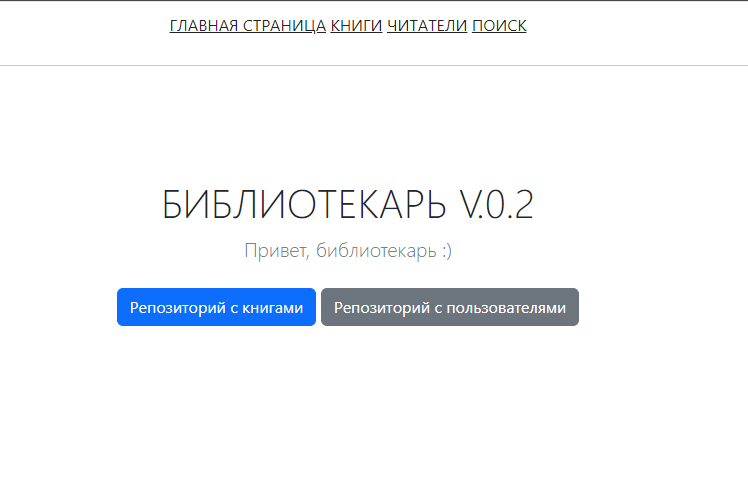
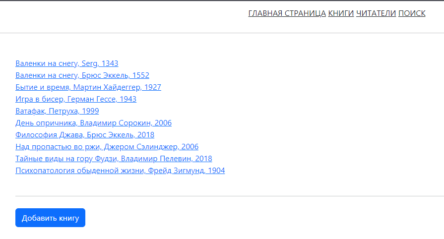
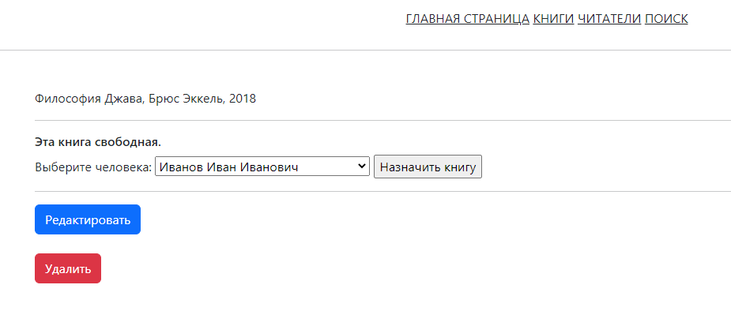
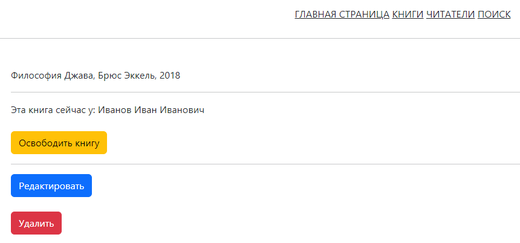
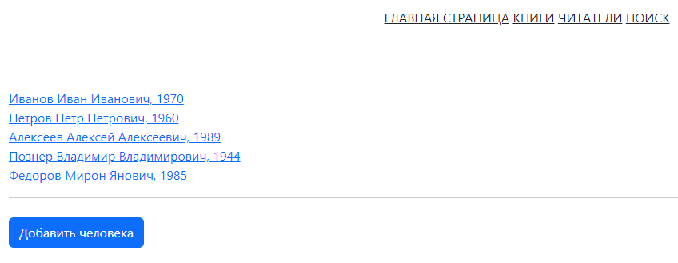
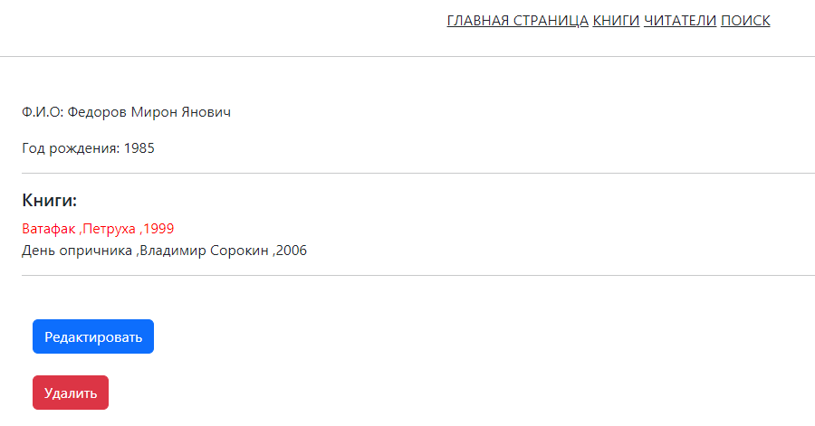

# java-bibliotecar
CRUD приложение Spring MVC, PostgreSQL (jdbctemplate), Thymeleaf, Tomcat

v.0.1 - представлена в ветке ver_0_1_jdbcTemplate, выполнена с использованием JDBCTemplate
v.0.2 - представлена в ветке ver_0_2_HibernateAndSpringDataJPA, выполнена с использованием Hibernate и Spring Data JPA

Приложение умеет:
* добавлять читателей и книги
* назначать книги читателям
* следить за читателями и наличием книг у них
* осуществлять поиск по базе данных книг
* высчитывать и выводить на экран просрочку пользования даты

